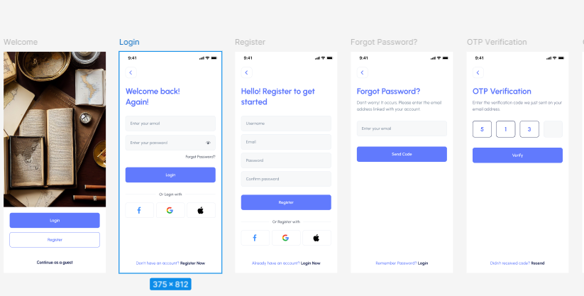

# 💳 X-Card Finance App

A modern mobile finance application built with **Flutter**, designed to manage virtual cards, track transactions, and provide a seamless banking experience.

---

## 📱 Screenshots


---

## ✨ Features

- 🔐 **Authentication**
  - Register with Username, Email & Password
  - Login with email/password
  - Social login (Google, Facebook, Apple)
  - Guest access (Continue as a guest)
  - OTP Email Verification

- 💳 **Card Management**
  - View multiple virtual cards (X-Card, M-Card)
  - Display card balance in EG (Egyptian Pound)
  - Masked card numbers for security

- 🏠 **Home Dashboard**
  - Personalized greeting with user name
  - Quick actions: Send Money, Pay the Bill, Request, Contact
  - Swipeable card carousel

- 📊 **Statistics & Reload**
  - Monthly income vs outcome bar chart
  - Date range filtering (e.g., Jan 28 – May 28, 2025)
  - Income summary: 15,000 EG
  - Outcome summary: 35,000 EG

- 👤 **Profile**
  - View Full Name, Email, Phone Number, Address
  - Edit profile information

---

## 🗂️ Project Structure

```
lib/
├── main.dart
├── app/
│   ├── routes/
│   └── theme/
├── features/
│   ├── auth/
│   │   ├── screens/
│   │   │   ├── welcome_screen.dart
│   │   │   ├── login_screen.dart
│   │   │   ├── register_screen.dart
│   │   │   └── otp_verification_screen.dart
│   │   └── widgets/
│   ├── home/
│   │   ├── screens/
│   │   │   └── home_screen.dart
│   │   └── widgets/
│   ├── cards/
│   │   ├── screens/
│   │   │   └── all_cards_screen.dart
│   │   └── widgets/
│   ├── statistics/
│   │   ├── screens/
│   │   │   └── reload_screen.dart
│   │   └── widgets/
│   └── profile/
│       ├── screens/
│       │   └── profile_screen.dart
│       └── widgets/
└── shared/
    ├── widgets/
    │   ├── bottom_nav_bar.dart
    │   └── card_widget.dart
    └── constants/
```

---

## 🛠️ Tech Stack

| Technology | Purpose |
|------------|---------|
| Flutter | Cross-platform UI framework |
| Dart | Programming language |
| fl_chart | Bar & line charts for statistics |
| Provider / Riverpod | State management |
| Dio / http | API networking |
| SharedPreferences | Local storage |
| Firebase Auth (optional) | Social login |

---

## 🚀 Getting Started

### Prerequisites

- Flutter SDK `>= 3.0.0`
- Dart SDK `>= 3.0.0`
- Android Studio / VS Code
- Android or iOS device/emulator

### Installation

1. **Clone the repository**
   ```bash
   git clone https://github.com/your-username/xcard-finance-app.git
   cd xcard-finance-app
   ```

2. **Install dependencies**
   ```bash
   flutter pub get
   ```

3. **Run the app**
   ```bash
   flutter run
   ```

4. **Build for production**
   ```bash
   # Android
   flutter build apk --release

   # iOS
   flutter build ios --release
   ```

---

## 🎨 Design System

### Color Palette

| Color | Hex | Usage |
|-------|-----|-------|
| Primary Blue | `#6C6FF3` | Buttons, Cards, Accents |
| Dark Navy | `#3D3F8F` | Secondary cards |
| White | `#FFFFFF` | Backgrounds |
| Light Gray | `#F5F5F5` | Input fields |
| Text Dark | `#1A1A2E` | Headings |

### Typography

- Font Family: **Inter** / **SF Pro**
- Headings: Bold, 24–28sp
- Body: Regular, 14–16sp
- Labels: Medium, 12sp

### Bottom Navigation

The app uses a custom bottom navigation bar with 5 tabs:
- 🏠 Home
- 📊 Statistic
- ➕ Quick Add (Center FAB)
- 💳 My Card
- 👤 Profile

---

## 🔑 App Screens Overview

### 1. Welcome Screen
Full-screen background image with **Login** and **Register** buttons, plus a "Continue as a guest" option.

### 2. Register Screen
Form with Username, Email, Password, Confirm Password fields. Social login options (Facebook, Google, Apple).

### 3. OTP Verification Screen
4-digit code entry with resend option. Code is sent to the user's email.

### 4. Home Dashboard
- Greeting header with notification bell
- Swipeable card carousel (X-Card, M-Card)
- Quick action buttons grid

### 5. All Cards Screen
List view of all virtual cards with balance and masked card number.

### 6. Statistics / Reload Screen
Bar chart comparing monthly income vs. outcome with date range picker.

### 7. My Profile Screen
Displays user details: Full Name, Email, Phone Number, and Address.

---

## 🌐 API Integration (Example)

```dart
// Example API call for user login
Future<UserModel> login(String email, String password) async {
  final response = await dio.post('/auth/login', data: {
    'email': email,
    'password': password,
  });
  return UserModel.fromJson(response.data);
}

// Example API call for cards
Future<List<CardModel>> getCards() async {
  final response = await dio.get('/cards');
  return (response.data as List)
      .map((card) => CardModel.fromJson(card))
      .toList();
}
```

---

## 🤝 Contributing

1. Fork the repository
2. Create your feature branch: `git checkout -b feature/amazing-feature`
3. Commit your changes: `git commit -m 'Add amazing feature'`
4. Push to the branch: `git push origin feature/amazing-feature`
5. Open a Pull Request

---

## 📄 License

This project is licensed under the MIT License. See the [LICENSE](LICENSE) file for details.

---

## 👨‍💻 Developer

**Ayat Essam**
- Email: ayatessam844@gmail.com
